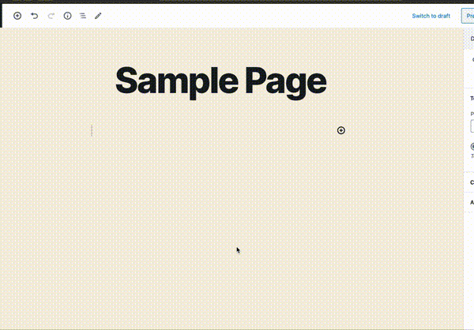

# Super Map Block
A wordpress plugin to provide geolocation to posts &amp; pages and display interactive maps (optionally with annotations). Uses [leaflet](https://leafletjs.com) for map display. Supports [OpenStreetMap](http://openstreetmap.org), [OpenTopoMap](http://opentopomap.org) and [Mapbox](https://www.mapbox.com) base maps, custom WMTS raster sources and GeoJSON vector overlays.

## Getting Started

This is the active, unstable development branch. Use at your own risk - stable releases to the [Wordpress Plugin Directory](https://wordpress.org/plugins/) coming soon!

It only contains the raw sources and requires a development environment to build the actual plugin. To use Mapbox instead of the default OpenStreetMap tiles, you will need a [Mapbox access token](https://docs.mapbox.com/help/how-mapbox-works/access-tokens/).

1. Run `npm install && npm run build` to build.
1. If all goes well, upload to your server (if not, please let me know!)
1. Activate the plugin
1. To use Mapbox, go to Plugins->stepman and paste your access token there.

## Locating Posts & Pages


After installing and activating the plugin, there will be a new sidebar in your Gutenberg editor (look for the globe icon in the top right corner). If it does not show up directly, you can access it through the `More tools and options` section (three vertical dots) at `Plugins` -> `Geolocation`.

You can place as many polygons, circles and/or markers on the map as you see fit to represent your page or post.

## Embedding maps in page content



The block can be found in the Embeds section, or just search for "Map Block". You can pan / zoom the map to a suitable location and this will be stored once you hit the save / update button. The sidebar gives you control over how much space the map block is allowed to take up (recommended settings are 100% width, and a suitable vertical size in pixels).

### Options
* Interaction (pan/zoom) on the front end can be disabled (but remains enabled in the editor).
* Post geolocation annotations can be optionally displayed as well.
* You can specify a custom WMTS URL & attribution to display as a raster overlay above the base map.

Adding multiple map blocks works as expected.

## GeoJSON media

This plugin also extends the WordPress media library to support GeoJSON files and display them in the map view.

## Integrating with other themes, plugins, and external software

Annotations are stored as a serialized [GeoJSON](https://geojson.org) `FeatureCollection` in the `stepman_meta_geolocation` field. GeoJSON does not directly support circles; those are therefore stored as points with an additional `radius` property:

```javascript
{ "type": "FeatureCollection",
  "features": [
    {
      /* -- a circle -- */
      "type": "Feature",   
      "properties" : {
        "radius": 129.59796699348766
      },
      "geometry": {
        "type": "Point",
        "coordinates": [ -15.112295, 64.289798 ]
    } },
    {
      /* -- a marker -- */
      "type":"Feature",
      "properties": {},
      "geometry": {
        "type": "Point",
        "coordinates": [ -15.108519, 64.29475 ]
    } }
  ]
}
```

Display styles can be changed by providing a `style` property as well, overriding any [Path options](https://leafletjs.com/reference-1.6.0.html#path-option) as required:

```javascript
{
  /* -- a red circle -- */
  "type": "Feature",   
  "properties" : {
    "radius": 100.0
    "style" : {
      "color": "#ff000"
    }
  },
  "geometry": {
    "type": "Point",
    "coordinates": [ -15.112295, 64.289798 ]
}
```

Both features (drawing circles from point features and custom, per-feature draw styles) are also supported for GeoJSON files loaded from the WordPress media library.

## Author

[Stephan Mantler](http://www.stephanmantler.com/)
<[step@stepman.is](mailto:step@stepman.is)>

## License

This project is licensed under the GPL v3 License - see the accompanying [LICENSE](LICENSE) file.
